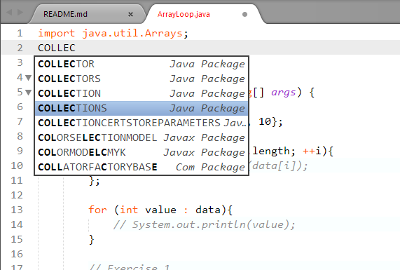

# Java Import Made Easy (JavaIME)

## About
**JavaIME** is a Sublime text package that makes importing any java package easy without worrying about namespacing.

## Installation
> Important: You need to have `Package Control` installed first on your sublime text which can be found at [The Package Contol Website](http://packagecontrol.io)

### Using Package Control's Repository

Go to `Preferences` --> `Package Control` --> `Add Repository` --> then type into the textbox `https://github.com/tushortz/JavaIME`

After doing this, then go to: `Preferences` --> `Package Control` --> `Install Package` --> then search `JavaIME` and click it.

The package will be installed and ready for use.

### Using Git

Locate your Sublime Text 2 `Packages` directory by using the menu item `Preferences -> Browse Packages...`.

While inside the `Packages` directory, clone the theme repository using the command below:

    git clone https://github.com/tushortz/JavaIME.git

### Download Manually

* Download the files using the GitHub .zip download option
* Unzip the files
* Copy the folder to your Sublime Text 2 `Packages` directory

optionally

###For windows
#### for Sublime text 2
copy the **JavaIME** folder and paste the file into the location of your default packages. It should be found by opening sublime text then clicking `preferences -> Packages`

#### For Sublime text 3
copy the **JavaIME** folder and paste the file into the following location.

##### File location

> **Note:** You will need to *show hidden files* first

> C:\Users\User name\AppData\Local\Sublime Text 3\Cache

## How to Use

On a Java file in sublime text, click on the line where you want to import the Java Package then type its name all in uppercase and suggestions should follow.

### Example
To import the *java.utils.Collections package*, type **COLLECTIONS** in *(uppercase)*. Suggestions should already be popping up then press *TAB* to select. The package will be automatically imported.

### Screenshot

## Contributing

All contributions are welcome. 

## License
© 2015 Taiwo Kareem | taiwo.kareem36@gmail.com.

This is free software. It is licensed under the MIT License. Feel free to use this in your own work. However, if you modify and/or redistribute it, please attribute me in some way, and it would be great if you distribute your work under this or a similar license, but it's not required.

## Acknowledgements
I'd first like to say a very big thank you to God my creator. Without him, this wouldn't be possible.

## Donating
> If you would like to show appreciation for the efforts and time spent making this, Please contact me on my email **taiwo.kareem36@gmail.com**

