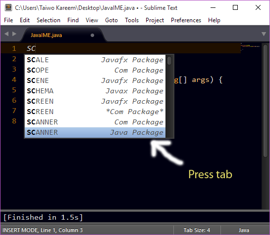

# Java Import Made Easy (JavaIME)

## About

This Sublime text package makes it easy to import virtually all Java packages, gives method completion suggestions for java methods, easily instantiate objects and create action listener methods.

## Screenshot


## How to Use

You can use a lot of JavaIME features in the following ways.


### Example
#### Import
> Note you can also press ENTER rather than TAB

To import the *java.utils.Collections package*, type **COLLECTIONS** in *(uppercase)*. Suggestions should already be popping up then press *TAB* to select. The package will be automatically imported.

#### Auto-Complete listener interfaces

To show a listener interface completion, type **L-** followed by the listener interface name. e.g.
	
**L-Focus** TAB should show 

```java
	FocusListener
```

#### Class Instance

Type **I-class name** e.g. **I-Scanner** should show
```java
	Scanner input = new Scanner(System.in);
```

#### Listener Events

Type **E-** followed by event and press tab. e.g.
	**E-act** then press TAB should show

```java
	public void actionPerformed(ActionEvent e){
	 // contents 
	}
```

#### Try Catch
You can also press **try** then TAB to get

```java
	try {
		
	}

	catch (Exception err) {
		System.out.println(err.getMessage());
	}
```

#### Methods

Methods pop up by default so you can just press TAB or ENTER.

#### Static properties
Type **S-** followed by method name. e.g.
Type **s-magenta**  then TAB to get

	MAGENTA


#### class declaration

* pc -> generates a public class declaration
* pcm -> generates the public class declaration with a main method
* pcc -> generates the public class declaration with a constructor
* pccm -> generates the public class declaration with a main method and constructor
* pcfx -> generates a public class declaration for JavaFX and a main method.

##### Example

> Assume we have a file named Test.java

Typing **pc** then `TAB` or `ENTER` should produce

``` java
public class Test {
	
}
```

Typing **pcc** then `TAB` or `ENTER` should produce

``` java
public class Test {
	
	// Constructor
	public Test(){
		
	}
	
}
```

Typing **pcm** then `TAB` or `ENTER` should produce

``` java
public class Test {

	public static void main(String[] args){
		
	}	
}
```

Typing **pcfx** then `TAB` or `ENTER` should produce

``` java
public class Test extends Application{

	@Override
	public void start(Stage primaryStage) throws Exception {
		// Contents
	}
	
	public static void main(String[] args){
		launch(args);
	}
	
}
```
> ... and so on!


## Installation
> Important: You need to have `Package Control` installed first on your sublime text which can be found at [The Package Contol Website](http://packagecontrol.io)

### Using Package Control's Repository

Go to `Preferences` --> `Package Control` --> `Add Repository` --> then type into the textbox `https://github.com/tushortz/JavaIME`

After doing this, then go to: `Preferences` --> `Package Control` --> `Install Package` --> then search `JavaIME` and click it.

The package will be installed and ready for use.


### Using Git

Locate your Sublime Text 2 `Packages` directory by using the menu item `Preferences -> Browse Packages...`.

While inside the `Packages` directory, clone the theme repository using the command below:

    git clone https://github.com/tushortz/JavaIME.git


### Download Manually

* Download the files using the GitHub .zip download option
* Unzip the files
* Copy the folder to your Sublime Text `Packages` directory


## Contributing

All contributions are welcome. fork me on [Github](https://github.com/tushortz/JavaIME) and create a `pull` request. Any suggestions or bugs, please let me know.

## License
© 2015 Taiwo Kareem | taiwo.kareem36@gmail.com.

Read **license.txt**

## Acknowledgements
I'd first like to say a very big thank you to God my creator. Without him, this wouldn't be possible.

